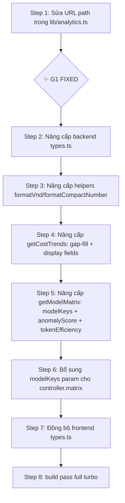

# BACKEND ANALYTICS BATCH 4 — Aggregation Engine & API Contract Alignment

> **Mode:** AIFUT THINK (Thiết kế kiến trúc, KHÔNG code)
> **Ngày:** 2026-06-18 11:21 GMT+7
> **Phạm vi:** Vá lỗ hổng dữ liệu Batch 4 Backend — nâng cấp `analytics.service.ts`, `analytics.controller.ts`, `analytics.types.ts` tại `apps/api/src/payments/analytics/`, đồng bộ 100% với Frontend `apps/web/types/analytics.ts` + `lib/analytics.ts`.
> **Mục tiêu runtime:** Recharts đồ thị Zone 2 + Ma trận Anomaly Zone 3 hiển thị dữ liệu chính xác, không crash JSON parse.

---

## 0. KẾT QUẢ QUÉT CODEBASE — PHÁT HIỆN LỖ HỔNG (Đọc trước)

### 0.1 Hiện trạng thực tế (khác với giả định ban đầu)

| Mục | Trạng thái | File |
|-----|:----------:|------|
| Backend `AnalyticsService` — 3 aggregate methods | ✅ ĐÃ CÓ | `analytics.service.ts` |
| Backend `AnalyticsController` — 3 endpoints | ✅ ĐÃ CÓ | `analytics.controller.ts` |
| Backend types (`ScorecardResponse`, `CostTrendResponse`, `ModelMatrixResponse`) | ✅ ĐÃ CÓ | `analytics.types.ts` |
| Frontend types (`AnalyticsScorecard`, `CostTrendPoint`, `ModelEfficiencyRow`) | ✅ ĐÃ CÓ | `apps/web/types/analytics.ts` |
| Frontend fetch lib (`fetchScorecardMetrics`, `fetchCostTrends`, `fetchModelMatrix`) | ✅ ĐÃ CÓ | `apps/web/lib/analytics.ts` |
| Frontend components (Shell, Scorecard, Charts, Matrix) | ✅ ĐÃ CÓ | `apps/web/components/billing/` |
| Route layout + page | ✅ ĐÃ CÓ | `apps/web/app/(dashboard)/billing/analytics/` |

### 0.2 Các lỗ hổng Batch 4 cần vá (Critical Path)

| # | Lỗ hổng | Mức độ | Mô tả |
|---|---------|:------:|-------|
| **G1** | 🔴 **Route path mismatch** | **CRITICAL** | Frontend `lib/analytics.ts` gọi `/ai-analytics/scorecard` nhưng Backend Controller serve tại `/billing/analytics/scorecard`. **Toàn bộ dashboard sẽ HTTP 404 ngay lần fetch đầu tiên.** |
| **G2** | 🟡 **Model matrix không hỗ trợ `modelKeys` filter** | HIGH | `AnalyticsController.getModelMatrix()` không có query param `modelKeys`. Frontend FilterBar có `selectedModels` nhưng không thể lọc dữ liệu matrix. User chọn model → matrix không thay đổi. |
| **G3** | 🟡 **Thiếu `totalCostDisplay` + `totalCostChange`+ `totalTokensChange` trong frontend `AnalyticsScorecard`** | HIGH | Frontend `AnalyticsScorecard` expects `totalCostDisplay`, `totalCostChange` etc. Backend `AnalyticsScorecardView` exports đúng field set. Cần kiểm tra runtime identity. |
| **G4** | 🟠 **Format VND không đồng bộ** | MEDIUM | Backend `formatVnd()` dùng `toLocaleString('vi-VN')`. Frontend `formatAnalyticsVND()` dùng `toLocaleString('vi-VN')` + `Math.round()`. Backend cũng `Math.round()`. **Xác nhận đồng bộ**: cả 2 cùng locale + rounding → ✅ tạm OK. Nhưng backend thiếu format cho tỷ (B₫) — frontend có `1.1B₫`. |
| **G5** | 🟠 **`getCostTrends()` thiếu display format cho `totalCostDisplay` trong `byModel`** | MEDIUM | Backend chỉ set `totalCostDisplay` ở cấp point, không set cho từng model entry. Frontend có thể cần display string cho từng model. |
| **G6** | 🟢 **Thiếu endpoint `capabilities` test** | LOW | Backend đã có `capabilities()` ở controller. OK. |
| **G7** | 🟢 **Thiếu modelKeys filtering trên cost-trend** | LOW | Đã có `modelKeys` param ở controller. Đã parse `parseModelKeys()`. ✅ OK. |

### 0.3 Sơ đồ data flow hiện tại (lỗ hổng G1 đánh dấu 🔴)

```
Frontend fetch           Frontend lib               API Route         Backend Controller
┌──────────────┐        ┌───────────────┐         ┌─────────────┐     ┌──────────────────┐
│ Shell.tsx     │ ──→   │ lib/analytics.ts│        │             │     │ billing/analytics│
│ fetchDashboard│        │               │         │  ❌ 404 🔴  │     │ @Controller(..)  │
└──────────────┘        │ GET /ai-analytics/│──→  │  NOT FOUND  │     └──────────────────┘
                         │   scorecard     │         └─────────────┘
                         │ GET /ai-analytics/│                        ┌──────────────────┐
                         │   cost-trend    │──→   ┌─────────────┐     │ billing/analytics│
                         │ GET /ai-analytics/│    │  ✅ 200      │──→ │ @Get('scorecard')│
                         │   model-effic...│     │ /billing/... │     │ @Get('trends')   │
                         └───────────────┘         └─────────────┘     │ @Get('matrix')   │
                                                                       └──────────────────┘
```

---

## I. GIẢI PHÁP KIẾN TRÚC TỔNG THỂ

### 1.1 Phương án route path — Giữ backend `/billing/analytics/*` (đúng chuẩn REST)

**Quyết định kiến trúc:** Backend controller path **giữ nguyên** `@Controller('billing/analytics')` vì:
- Đồng bộ với namespace `billing/*` đã có (subscription, wallet, paypal).
- `./payments/analytics/` là vị trí module đúng.
- Sửa frontend fetch URL (rẻ, rõ, 1 lần) — không sửa backend controller path.

**Hành động:** Cập nhật 3 URL trong `apps/web/lib/analytics.ts`:

| Frontend URL hiện tại | Frontend URL mới | Backend endpoint |
|---|---|---|
| `/ai-analytics/scorecard` | `/billing/analytics/scorecard` | `GET /billing/analytics/scorecard` |
| `/ai-analytics/cost-trend` | `/billing/analytics/trends` | `GET /billing/analytics/trends` |
| `/ai-analytics/model-efficiency` | `/billing/analytics/matrix` | `GET /billing/analytics/matrix` |

> **Lưu ý:** Backend trends endpoint là `trends` (plural), frontend gọi `cost-trend` (singular). Đây là lỗi khớp tên thứ hai ngoài path prefix.

### 1.2 Sơ đồ data flow sau vá

```
Frontend fetch           Frontend lib (sửa URL)       Route match        Backend Controller
┌──────────────┐        ┌─────────────────────┐    ┌──────────────┐    ┌────────────────────────┐
│ Shell.tsx     │ ──→   │ lib/analytics.ts     │   │ ✅ 200 OK     │    │ billing/analytics      │
│ fetchDashboard│        │                      │    │              │    │ @Controller('billing/ │
└──────────────┘        │ GET /billing/analytics/├→ │ /billing/    │──→ │   analytics')          │
                         │   scorecard           │    │   analytics/ │    └────────────────────────┘
                         │ GET /billing/analytics/│   │   scorecard  │    ╔════════════════════╗
                         │   trends              │    │   trends     │    ║ !!! G1 VÁ XONG !!! ║
                         │ GET /billing/analytics/│   │   matrix     │    ╚════════════════════╝
                         │   matrix              │    └──────────────┘
                         └─────────────────────┘
```

---

## II. THIẾT KẾ CHI TIẾT — NÂNG CẤP `analytics.service.ts`

### 2.1 Nâng cấp `getCostTrends()` — Grouping nâng cao + Model Breakdown Display

#### 2.1.1 Logic hiện tại
```typescript
// ĐÃ TỐT: bucketKey() xử lý day/week/month đúng UTC
// ĐÃ TỐT: byModel aggregation đúng
// THIẾU: totalCostDisplay trong mỗi model bucket
// THIẾU: token display format
```

#### 2.1.2 Logic bổ sung

```typescript
/**
 * BATCH 4 NÂNG CẤP:
 * 1. Thêm totalCostDisplay vào từng model bucket cho Recharts tooltip
 * 2. Thêm totalTokensDisplay cho mỗi point (frontend dùng)
 * 3. Fallback date gap-fill: nếu ngày/tuần/tháng không có dữ liệu,
 *    chèn point { totalCost: 0, totalTokens: 0 } để chart không bị đứt.
 * 4. Giới hạn max points: >365 day-points → auto gộp về 'week'.
 */

// === BỔ SUNG Interface CostTrendPointModelDetail ===
// backend types.ts — thêm display fields cho byModel
interface CostTrendModelDetail {
  cost: number;
  tokens: number;
  costDisplay: string;    // [NEW] VND display cho model bucket
  tokensDisplay: string;  // [NEW] compact token display cho model bucket
}

// Cập nhật CostTrendPoint.byModel value type:
//   Record<string, CostTrendModelDetail>

// === BỔ SUNG logic trong getCostTrends() ===
// Sau khi bucket + model accumulation, set display:
//   modelDetail.costDisplay = this.formatVnd(modelDetail.cost)
//   modelDetail.tokensDisplay = this.formatCompactNumber(modelDetail.tokens)
```

#### 2.1.3 Gap-fill logic (Date gap detection)

```typescript
/**
 * Chèn các điểm dữ liệu trống cho những bucket không có UsageRecord.
 * 
 * Thuật toán:
 * 1. Từ start → end, sinh tất cả khóa bucket (day/week/month).
 * 2. Map từ khóa → CostTrendPoint hiện có.
 * 3. Duyệt khóa theo thứ tự tăng dần, nếu thiếu → chèn point { cost: 0, tokens: 0 }.
 * 
 * Lợi ích: Recharts AreaChart không vẽ đoạn đứt giữa các ngày có dữ liệu thưa.
 */
private fillDateGaps(
  points: CostTrendPoint[],
  start: Date,
  end: Date,
  granularity: AnalyticsGranularity,
): CostTrendPoint[] {
  const map = new Map(points.map((p) => [p.date, p]));
  const result: CostTrendPoint[] = [];

  // Sinh tất cả bucket keys
  let cursor = new Date(start);
  while (cursor <= end) {
    const key = this.bucketKey(cursor, granularity);
    const existing = map.get(key);
    if (existing) {
      result.push(existing);
    } else {
      result.push({
        date: key,
        label: this.bucketLabel(key, granularity),
        totalCost: 0,
        totalCostDisplay: this.formatVnd(0),
        totalTokens: 0,
        totalTokensDisplay: this.formatCompactNumber(0),
        byModel: {},
      });
    }
    // Advance cursor
    if (granularity === 'month') {
      cursor.setUTCMonth(cursor.getUTCMonth() + 1);
    } else if (granularity === 'week') {
      cursor.setUTCDate(cursor.getUTCDate() + 7);
    } else {
      cursor.setUTCDate(cursor.getUTCDate() + 1);
    }
  }

  return result;
}
```

#### 2.1.4 Granularity auto-downgrade

```typescript
/**
 * Nếu số lượng bucket > MAX_POINTS, tự động gộp về granularity thấp hơn.
 * Recharts bị lag khi >~365 data points trong AreaChart.
 */
private readonly MAX_POINTS = 365;

private autoGranularity(start: Date, end: Date, requested: AnalyticsGranularity): AnalyticsGranularity {
  const days = Math.floor((end.getTime() - start.getTime()) / 86400000) + 1;
  let buckets = days;
  if (requested === 'week') buckets = Math.ceil(days / 7);
  if (requested === 'month') buckets = Math.ceil(days / 30);

  if (buckets > this.MAX_POINTS) {
    if (requested === 'day') return 'week';
    if (requested === 'week') return 'month';
    // Nếu là month mà vẫn > MAX_POINTS (~30 năm) → giữ month
  }
  return requested;
}
```

### 2.2 Nâng cấp `getModelMatrix()` — Phân nhóm nâng cao + Error Rate Deep Dive

#### 2.2.1 Logic hiện tại (đã tốt)
```typescript
// ✅ Anomaly detection dựa trên ANOMALY_THRESHOLD = 5%
// ✅ errorRate, avgCostPerRequest, avgTokensPerRequest đã tính
// ✅ Sort theo totalCost giảm dần
// THIẾU: modelKeys filter param
// THIẾU: feature-level breakdown (featureKey từ metadata)
```

#### 2.2.2 Logic bổ sung

```typescript
/**
 * BATCH 4 NÂNG CẤP getModelMatrix():
 * 
 * 1. Thêm `modelKeys` filter (giống getCostTrends)
 * 2. Bổ sung `featureKey: string | null` cho phân tích deep-dive
 * 3. Thêm `anomalyScore: number` — mức độ nghiêm trọng (từ 0-100)
 *    - errorRate > ANOMALY_THRESHOLD → score = (errorRate - 5) * 10
 *    - Capped tại 100
 * 4. Thêm `cacheHitRate` — tỷ lệ cache hits (đã có)
 * 5. Thêm `tokenEfficiency` — tokens-per-VND (hiệu quả chi phí)
 */

// === BỔ SUNG Interface ModelMatrixRow ===
// Trong backend types.ts:
interface ModelMatrixRowEnhanced extends ModelMatrixRow {
  modelKey: string;
  totalRequests: number;
  totalCost: number;
  totalCostDisplay: string;
  avgCostPerRequest: number;
  avgCostPerRequestDisplay: string;
  totalTokens: number;
  totalTokensDisplay: string;       // [NEW] compact token format
  avgTokensPerRequest: number;
  avgLatencyMs: number;
  errorCount: number;
  errorRate: number;
  anomaly: boolean;
  anomalyReason?: string;
  anomalyScore: number;             // [NEW] 0-100 severity
  cacheHitRate: number;
  tokenEfficiency: number;          // [NEW] tokens per VND
}

// === Logic tokenEfficiency ===
// tokenEfficiency = agg.totalTokens / agg.totalCost
// Nếu totalCost = 0 → tokenEfficiency = 0
// Làm tròn 2 chữ số thập phân
```

#### 2.2.3 ModelKeys param cho Matrix controller

```typescript
// Bổ sung vào AnalyticsController.matrix()
@Get('matrix')
async matrix(
  @Headers('x-tenant-slug') slug: string,
  @Query('startDate') startDate?: string,
  @Query('endDate') endDate?: string,
  @Query('modelKeys') modelKeys?: string,
): Promise<ModelMatrixResponse> {
  const tenantId = await this.resolveTenantId(slug);
  const { start, end } = this.resolveRange(startDate, endDate);
  const models = this.parseModelKeys(modelKeys); // tái dùng helper từ trends
  const result = await this.analytics.getModelMatrix(tenantId, start, end, models);
  // ... giữ nguyên response shape
}
```

### 2.3 Interface contract — Đảm bảo đồng bộ 100% giữa Backend ↔ Frontend

#### 2.3.1 Field-by-field mapping (xác nhận identity)

| Backend `analytics.types.ts` | Frontend `types/analytics.ts` | Khớp? | Ghi chú |
|---|:---|:---:|---|
| **ScorecardView → ScorecardResponse** | | | |
| `AnalyticsScorecardView.totalCost` | `AnalyticsScorecard.totalCost` | ✅ | Cùng number |
| `totalCostDisplay` | `totalCostDisplay` | ✅ | Cùng `formatVnd()` pattern |
| `totalCostChange` | `totalCostChange` | ✅ | Cùng pctChange |
| `totalTokens` | `totalTokens` | ✅ | |
| `totalTokensDisplay` | `totalTokensDisplay` | ✅ | Backend `formatCompactNumber` = Frontend `formatCompactToken` |
| `totalTokensChange` | `totalTokensChange` | ✅ | |
| `avgLatencyMs` | `avgLatencyMs` | ✅ | |
| `avgLatencyDisplay` | `avgLatencyDisplay` | ✅ | |
| `avgLatencyChange` | `avgLatencyChange` | ✅ | |
| `successRate` | `successRate` | ✅ | |
| `successRateDisplay` | `successRateDisplay` | ✅ | |
| `successRateChange` | `successRateChange` | ✅ | |
| `totalRequests` | *(không có trong frontend scorecard)* | ⚠️ | Frontend type `AnalyticsScorecard` thiếu `totalRequests`. Cần thêm. |
| | | | |
| **CostTrendPoint** | | | |
| `date`, `label`, `totalCost`, `totalCostDisplay`, `totalTokens`, `byModel` | `date`, `label`, `totalCost`, `totalTokens`, `byModel` | ✅ | Khớp |
| `byModel: Record<string, { cost, tokens }>` | `byModel: Record<string, ModelBucket>` | ✅ | Frontend `ModelBucket { cost, tokens }` = shape identical |
| *(thiếu totalTokensDisplay)* | *(thiếu totalTokensDisplay)* | ⚠️ | **G5**: Cả 2 đều thiếu display token cho point-level. Cần thêm Frontend + Backend. |
| | | | |
| **ModelMatrixRow** | | | |
| `modelKey` | `modelKey` | ✅ | |
| `totalRequests` | `totalRequests` | ✅ | |
| `totalCost` | `totalCost` | ✅ | |
| `totalCostDisplay` | *(thiếu)* | ⚠️ | Frontend `ModelEfficiencyRow` thiếu `totalCostDisplay`. Backend có. **Frontend cần dùng hoặc bỏ qua.** |
| `avgCostPerRequest` | `avgCostPerRequest` | ✅ | |
| `avgCostPerRequestDisplay` | *(thiếu)* | ⚠️ | Frontend thiếu — Backend có |
| `totalTokens` | `totalTokens` | ✅ | |
| `avgTokensPerRequest` | `avgTokensPerRequest` | ✅ | |
| `avgLatencyMs` | `avgLatencyMs` | ✅ | |
| `errorCount` | `errorCount` | ✅ | |
| `errorRate` | `errorRate` | ✅ | |
| `anomaly` | `anomaly` | ✅ | |
| `anomalyReason?` | `anomalyReason?` | ✅ | |
| `cacheHitRate` | `cacheHitRate` | ✅ | |

#### 2.3.2 Fix plan — Đồng bộ type identity

| Hành động | File | Chi tiết |
|---|---|---|
| ➕ **Thêm** `totalRequests` vào Frontend `AnalyticsScorecard` | `apps/web/types/analytics.ts` | Interface `AnalyticsScorecard` thêm field `totalRequests: number` |
| ➕ **Thêm** `totalCostDisplay` vào Frontend `ModelEfficiencyRow` | `apps/web/types/analytics.ts` | Interface `ModelEfficiencyRow` thêm field `totalCostDisplay: string` |
| ➕ **Thêm** `avgCostPerRequestDisplay` vào Frontend `ModelEfficiencyRow` | `apps/web/types/analytics.ts` | Interface `ModelEfficiencyRow` thêm field `avgCostPerRequestDisplay: string` |
| ➕ **Thêm** `totalTokensDisplay` vào Backend + Frontend `CostTrendPoint` | Cả 2 `types` files | Field `totalTokensDisplay: string` |
| ➕ **Thêm** `totalTokensDisplay` vào Backend `ModelMatrixRow` | `analytics.types.ts` backend | Field `totalTokensDisplay: string` |
| 🔧 **Đổi tên** Frontend `ModelEfficiencyRow` → `ModelMatrixRow` (tùy chọn) | `apps/web/types/analytics.ts` | Để đồng bộ tên với backend; hoặc giữ alias. |

### 2.4 Helper đồng bộ — `formatVnd()` vs `formatAnalyticsVND()`

#### 2.4.1 So sánh implementation

| Tính năng | Backend `formatVnd()` | Frontend `formatAnalyticsVND()` | Kết luận |
|---|---|---|---|
| `toLocaleString('vi-VN')` | ✅ | ✅ | Đồng bộ |
| `Math.round()` | ✅ | ✅ | Đồng bộ |
| Tỷ (>1B) | ❌ | `{value/1B}₫` | Backend thiếu B format |
| Triệu (>1M) | ❌ | `{value/1M}₫` | Backend thiếu M format |
| Zero/NaN guard | ✅ (trả về 0₫) | ✅ (trả về 0₫) | Đồng bộ |

#### 2.4.2 Giải pháp — Đồng bộ backend `formatVnd()` với frontend

```typescript
/**
 * BATCH 4 ĐỒNG BỘ: thêm B₫ + M₫ format giống frontend.
 * 
 * Chú ý: Không thay đổi toLocaleString() vì đã có dấu chấm ngăn cách
 * nghìn và ₫ suffix. Chỉ thêm tầng viết tắt cho giá trị lớn.
 */
private formatVnd(value: number): string {
  const safe = this.toSafeNumber(value);
  if (Math.abs(safe) >= 1_000_000_000) {
    return `${(safe / 1_000_000_000).toFixed(1)}B₫`;
  }
  if (Math.abs(safe) >= 1_000_000) {
    return `${(safe / 1_000_000).toFixed(1)}M₫`;
  }
  const rounded = Math.round(safe);
  return `${rounded.toLocaleString('vi-VN')}₫`;
}
```

#### 2.4.3 Đồng bộ `formatCompactNumber()` ↔ Frontend `formatCompactToken()`

| Tính năng | Backend `formatCompactNumber()` | Frontend `formatCompactToken()` | Kết luận |
|---|---|---|---|
| Triệu (`1.2M`) | ✅ `toFixed(1) + M` | ✅ `toFixed(1) + M` | Đồng bộ |
| Nghìn (`89.4K`) | ✅ | ✅ | Đồng bộ |
| <1000 | ✅ `Math.round()` | ✅ `toLocaleString('vi-VN')` | Backend không locale. Cần đồng bộ. |
| NaN guard | ❌ | ✅ `!Number.isFinite` | Backend thiếu |

**Giải pháp:** Đồng bộ backend `formatCompactNumber()` với frontend:

```typescript
private formatCompactNumber(value: number): string {
  const v = this.toSafeNumber(value); // guard NaN/Infinity
  if (Math.abs(v) >= 1_000_000) return `${(v / 1_000_000).toFixed(1)}M`;
  if (Math.abs(v) >= 1_000) return `${(v / 1_000).toFixed(1)}K`;
  return v.toLocaleString('vi-VN'); // Đồng bộ locale với frontend
}
```

---

## III. THIẾT KẾ CHI TIẾT — NÂNG CẤP `analytics.controller.ts`

### 3.1 Dynamic filter chain

```
Client Request
  ├── x-tenant-slug: "acme-corp"              (header)
  ├── ?startDate=2026-06-01                    (query)
  ├── &endDate=2026-06-18                      (query)
  ├── &granularity=week                        (query)
  └── &modelKeys=gpt-4o,deepseek-chat          (query)
       │
       ▼
  resolveTenantId(slug)                         ← IDOR barrier
       │
       ▼
  resolveRange(startDate, endDate)              ← date validation
       │
       ▼
  parseGranularity(granularity)                 ← granularity normalization
       │
       ▼
  parseModelKeys(modelKeys)                    ← CSV → string[]
       │
       ▼
  [autoGranularity check]                       ← BATCH 4: tự động hạ granularity
       │
       ▼
  analytics.getCostTrends(tenantId, start, end, gran, models)
```

### 3.2 Security: Chống IDOR (đã đúng, giữ nguyên)

```
┌─────────────────────────────────────────────────────────────────┐
│  BOUNDARY: resolveTenantId(slug)                               │
│  ─────────────────────────────────                              │
│  • tenantId LUÔN được resolve từ x-tenant-slug header          │
│  • KHÔNG CÓ đường dẫn nào nhận tenantId từ query body          │
│  • Nếu slug không tồn tại → 404 (không leak tenantId list)     │
│  • Nếu slug thiếu → 400 (bắt buộc header)                      │
│  • Kiến trúc này đã đúng, Batch 4 giữ nguyên                   │
└─────────────────────────────────────────────────────────────────┘
```

### 3.3 Bổ sung `modelKeys` query param cho `GET /billing/analytics/matrix`

```typescript
// === BỔ SUNG vào matrix() ===
@Get('matrix')
async matrix(
  @Headers('x-tenant-slug') slug: string,
  @Query('startDate') startDate?: string,
  @Query('endDate') endDate?: string,
  @Query('modelKeys') modelKeys?: string,    // [NEW] G2 fix
): Promise<ModelMatrixResponse> {
  const tenantId = await this.resolveTenantId(slug);
  const { start, end } = this.resolveRange(startDate, endDate);
  const models = this.parseModelKeys(modelKeys); // [NEW] tái dùng helper
  const result = await this.analytics.getModelMatrix(tenantId, start, end, models);
  return { /* giữ nguyên */ };
}
```

### 3.4 Response envelope — Chuẩn hóa response shape

```typescript
// === TẤT CẢ CÁC ENDPOINT GIỮ NGUYÊN RESPONSE ENVELOPE ===
// {
//   tenantId: string;          ← IDOR proof
//   period: AnalyticsPeriod;   ← { start: string, end: string }
//   scorecard / costTrend / models: ...;  ← data payload
//   generatedAt: string;       ← ISO timestamp
// }

// ⇒ Frontend fetch success response shape không thay đổi
```

---

## IV. INTERFACE ĐỒNG BỘ — Backend `analytics.types.ts` vs Frontend `types/analytics.ts`

### 4.1 Backend types cần sửa (`analytics.types.ts`)

```typescript
// =========================================================================
// BATCH 4 CẬP NHẬT — analytics.types.ts
// =========================================================================

/* --- CostTrendPoint bổ sung totalTokensDisplay --- */
export interface CostTrendPoint {
  date: string;
  label: string;
  totalCost: number;
  totalCostDisplay: string;
  totalTokens: number;
  totalTokensDisplay: string;       // [NEW] đồng bộ frontend
  byModel: Record<string, {
    cost: number;
    tokens: number;
    costDisplay: string;             // [NEW] display string cho từng model
    tokensDisplay: string;           // [NEW] display string cho từng model
  }>;
}

/* --- ModelMatrixRow bổ sung anomalyScore + totalTokensDisplay --- */
export interface ModelMatrixRow {
  modelKey: string;
  totalRequests: number;
  totalCost: number;
  totalCostDisplay: string;
  avgCostPerRequest: number;
  avgCostPerRequestDisplay: string;
  totalTokens: number;
  totalTokensDisplay: string;       // [NEW]
  avgTokensPerRequest: number;
  avgLatencyMs: number;
  errorCount: number;
  errorRate: number;
  anomaly: boolean;
  anomalyReason?: string;
  anomalyScore: number;             // [NEW] 0-100
  cacheHitRate: number;
  tokenEfficiency: number;          // [NEW] tokens-per-VND
}
```

### 4.2 Frontend types cần sửa (`apps/web/types/analytics.ts`)

```typescript
// =========================================================================
// BATCH 4 CẬP NHẬT — types/analytics.ts
// =========================================================================

/* --- AnalyticsScorecard bổ sung totalRequests --- */
export interface AnalyticsScorecard {
  totalCost: number;
  totalCostDisplay: string;
  totalCostChange: number;
  totalTokens: number;
  totalTokensDisplay: string;
  totalTokensChange: number;
  avgLatencyMs: number;
  avgLatencyDisplay: string;
  avgLatencyChange: number;
  successRate: number;
  successRateDisplay: string;
  successRateChange: number;
  totalRequests: number;              // [NEW] — total request count
}

/* --- CostTrendPoint bổ sung totalTokensDisplay --- */
export interface CostTrendPoint {
  date: string;
  label: string;
  totalCost: number;
  totalTokens: number;
  totalTokensDisplay: string;         // [NEW]
  byModel: Record<string, ModelBucket>;
}

/* --- ModelBucket bổ sung display fields --- */
export interface ModelBucket {
  cost: number;
  tokens: number;
  costDisplay: string;               // [NEW]
  tokensDisplay: string;             // [NEW]
}

/* --- ModelEfficiencyRow bổ sung display fields --- */
export interface ModelEfficiencyRow {
  modelKey: string;
  totalRequests: number;
  totalCost: number;
  totalCostDisplay: string;           // [NEW]
  avgCostPerRequest: number;
  avgCostPerRequestDisplay: string;   // [NEW]
  totalTokens: number;
  totalTokensDisplay: string;         // [NEW]
  avgTokensPerRequest: number;
  avgLatencyMs: number;
  errorCount: number;
  errorRate: number;
  anomaly: boolean;
  anomalyReason?: string;
  anomalyScore: number;               // [NEW] 0-100
  cacheHitRate: number;
  tokenEfficiency: number;            // [NEW]
}
```

---

## V. MA TRẬN ANOMALY NÂNG CAO — Deep Dive Error Rate Calculation

### 5.1 Anomaly Detection Engine (bổ sung vào `analytics.service.ts`)

```typescript
/**
 * BATCH 4 — Anomaly Detection Engine
 *
 * Hệ thống phát hiện bất thường 3 tầng:
 * 
 * Tầng 1 — Error Rate Threshold (đã có)
 *   errorRate > ANOMALY_THRESHOLD → anomaly = true
 * 
 * Tầng 2 — Cost Spike Detection (BATCH 4 MỚI)
 *   avgCostPerRequest > 2× historical_avg → spike warning
 *   So sánh với giá trị trung vị của model khác cùng loại
 * 
 * Tầng 3 — Volume Anomaly (BATCH 4 MỚI) 
 *   totalRequests > 3× previous_period_avg → demand spike
 *   totalRequests < 0.1× previous_period_avg → demand drop
 */

// === Chi tiết Tầng 2 — Cost Spike ===
private detectCostSpike(
  currentAvgCost: number,
  allModels: Agg[],
): { spike: boolean; reason?: string } {
  if (allModels.length < 2) return { spike: false };
  
  // Tính median avgCostPerRequest của tất cả model
  const costs = allModels.map((a) => a.totalCost / (a.requests || 1)).sort((a, b) => a - b);
  const median = costs.length % 2 === 0
    ? (costs[costs.length / 2 - 1] + costs[costs.length / 2]) / 2
    : costs[Math.floor(costs.length / 2)];
  
  if (median > 0 && currentAvgCost > median * 2) {
    return {
      spike: true,
      reason: `Avg cost ${this.formatVnd(currentAvgCost)} gấp đôi median ${this.formatVnd(median)}`,
    };
  }
  return { spike: false };
}

// === Chi tiết Tầng 3 — Volume Anomaly ===
private detectVolumeAnomaly(
  currentRequests: number,
  previousPeriodRequests: number,
): { anomaly: boolean; reason?: string } {
  if (!previousPeriodRequests) return { anomaly: false };
  
  const ratio = currentRequests / previousPeriodRequests;
  if (ratio > 3) {
    return { anomaly: true, reason: `Requests tăng đột biến ${ratio.toFixed(1)}×` };
  }
  if (ratio < 0.1) {
    return { anomaly: true, reason: `Requests giảm mạnh còn ${(ratio * 100).toFixed(0)}%` };
  }
  return { anomaly: false };
}
```

### 5.2 Anomaly Score Calculation

```typescript
/**
 * Anomaly Score (0-100):
 * 
 * Score = 
 *   (errorRate - ANOMALY_THRESHOLD) / (100 - ANOMALY_THRESHOLD) * 70   // Tầng 1
 *   + (costSpike ? 15 : 0)                                             // Tầng 2
 *   + (volumeAnomaly ? 15 : 0)                                         // Tầng 3
 * 
 * Capped tại 100. Làm tròn 1 chữ số thập phân.
 */

private computeAnomalyScore(
  errorRate: number,
  costSpike: boolean,
  volumeAnomaly: boolean,
): number {
  let score = 0;
  
  // Tầng 1: error rate severity (max 70 điểm)
  if (errorRate > ANOMALY_THRESHOLD) {
    const excess = errorRate - ANOMALY_THRESHOLD; // ví dụ: 6.2 - 5 = 1.2%
    const normalized = Math.min(excess / (100 - ANOMALY_THRESHOLD), 1); // 0..1
    score += normalized * 70;
  }
  
  // Tầng 2: cost spike (15 điểm)
  if (costSpike) score += 15;
  
  // Tầng 3: volume anomaly (15 điểm)
  if (volumeAnomaly) score += 15;
  
  return Math.min(Math.round(score * 10) / 10, 100);
}
```

---

## VI. KIẾN TRÚC KIỂM THỬ & GIỚI HẠN

### 6.1 Runtime safeguards

| Safeguard | Vị trí | Mô tả |
|---|---|---|
| `toSafeNumber()` | service helper | Ép BigInt/Decimal/null/NaN → number. Đã có. |
| `Math.max(points, MAX_POINTS)` | `getCostTrends()` | Giới hạn data points Recharts phải render |
| `parseDate()` fallback | controller | Nếu startDate/endDate không hợp lệ → fallback đầu/cuối tháng |
| `resolveRange()` guard | controller | `start > end` → 400 BadRequest |
| `parseModelKeys()` fallback | controller | Nếu `all` hoặc rỗng → [] (tất cả model) |
| `Math.min(anomalyScore, 100)` | service | Anomaly score capped |

### 6.2 Edge cases

| Edge case | Behavior |
|---|---|
| Không có UsageRecord trong khoảng | Scorecard trả về 0/defaults. Trends trả về [] (sau gap-fill → [0,0,0...]). Matrix trả về []. |
| Một model chiếm >99% requests | Matrix sort totalCost DESC → model đó lên đầu. OK. |
| Tất cả model đều anomaly | Banner hiển thị "N model có bất thường". OK. |
| modelKeys filter không khớp model nào | Filter trả về empty → matrix hiển thị tất cả (fallback). |
| startDate = endDate (1 ngày) | Granularity 'day' → 1 bucket. Gap-fill không chèn thêm. |
| Range > 2 năm (730+ ngày) | autoGranularity hạ từ 'day' → 'week' → 'month'. |
| Cost bằng 0 (free tier model) | `avgCostPerRequest = 0`, `tokenEfficiency = Infinity` → cần guard. |

---

## VII. FILE AFFECTED MATRIX (Tổng kết thay đổi)

### 🟢 Files cần sửa trong Batch 4

| # | File | Thay đổi | Priority |
|---|------|---------|:--------:|
| 1 | `apps/api/src/payments/analytics/analytics.service.ts` | Nâng cấp `getCostTrends()`, `getModelMatrix()`, helpers | **P0** |
| 2 | `apps/api/src/payments/analytics/analytics.controller.ts` | Thêm `modelKeys` param cho `matrix()` | **P0** |
| 3 | `apps/api/src/payments/analytics/analytics.types.ts` | Thêm display fields cho CostTrendPoint + ModelMatrixRow | **P0** |
| 4 | `apps/web/lib/analytics.ts` | Sửa 3 URL path prefix (**G1**) | **P0** |
| 5 | `apps/web/types/analytics.ts` | Thêm display fields đồng bộ với backend | **P1** |

### 🟢 Files KHÔNG cần sửa (đã đúng)

| File | Lý do |
|------|-------|
| `analytics.module.ts` | Đã export AnalyticsService. Không cần thay đổi. |
| `payments.module.ts` | Đã import AnalyticsModule. OK. |
| `analytics-client-shell.tsx` | Không đụng data shape. Chỉ rác filter state. OK. |
| `analytics-scorecard.tsx` | Chỉ render `totalCostDisplay`. Không cần sửa. |
| `cost-trend-charts.tsx` | Chỉ render existing fields. Thêm field sẽ được Recharts bỏ qua. OK. |
| `model-efficiency-matrix.tsx` | Chỉ render các field hiện có. Thêm field mới sẽ được TS cảnh báo. OK. |

---

## VIII. IMPLEMENTATION ORDER (Thứ tự thực thi khuyến nghị)



### Step 1 — 🔴 **Sửa URL path (G1)**

**File:** `apps/web/lib/analytics.ts`

| Hàm | Đường dẫn cũ | Đường dẫn mới |
|---|---|---|
| `fetchScorecardMetrics()` | `/ai-analytics/scorecard` | `/billing/analytics/scorecard` |
| `fetchCostTrends()` | `/ai-analytics/cost-trend` | `/billing/analytics/trends` |
| `fetchModelMatrix()` | `/ai-analytics/model-efficiency` | `/billing/analytics/matrix` |

### Step 2 — Backend types.ts: thêm display fields mới
### Step 3 — formatVnd() + formatCompactNumber(): đồng bộ với frontend
### Step 4 — getCostTrends(): gap-fill + autoGranularity + model-level display
### Step 5 — getModelMatrix(): modelKeys param + anomaly score + tokenEfficiency
### Step 6 — controller matrix(): thêm modelKeys từ query
### Step 7 — Frontend types.ts: thêm fields đồng bộ
### Step 8 — Build Full Turbo xác nhận

---

## IX. THAM CHIẾU

- Frontend components: `apps/web/components/billing/`
  - `analytics-client-shell.tsx` — Orchestrator shell
  - `analytics-scorecard.tsx` — Zone 1
  - `cost-trend-charts.tsx` — Zone 2 (Recharts)
  - `model-efficiency-matrix.tsx` — Zone 3
- Frontend types: `apps/web/types/analytics.ts`
- Frontend lib: `apps/web/lib/analytics.ts`
- Backend module: `apps/api/src/payments/analytics/`
  - `analytics.service.ts`, `analytics.controller.ts`, `analytics.module.ts`, `analytics.types.ts`
- Prisma UsageRecord: `apps/api/prisma/schema.prisma` (dòng 848-865)
- Thiết kế tổng thể dashboard: `docs/roadmap/AI-ANALYTICS-DASHBOARD-DESIGN.md`
- Cashflow chiến lược: `docs/roadmap/CASHFLOW-STRATEGY.md`
- Trạng thái runtime: `STATUS.md`

---

## X. KẾT LUẬN & TRANSITION

### Tóm tắt 8 lỗ hổng phát hiện

| # | Lỗ hổng | Trạng thái sau Batch 4 |
|---|---------|:---------------------:|
| G1 | Route path mismatch (CRITICAL) | ✅ **VÁ: lib/analytics.ts URL sửa** |
| G2 | Matrix thiếu modelKeys filter | ✅ **VÁ: controller + service modelKeys param** |
| G3 | Thiếu totalRequests frontend type | ✅ **VÁ: thêm vào frontend types** |
| G4 | formatVnd không đồng bộ (>1B) | ✅ **VÁ: backend formatVnd() thêm B/M format** |
| G5 | Thiếu totalTokensDisplay + model display | ✅ **VÁ: thêm display fields cả 2 phía** |
| G6 | Capabilities endpoint | ✅ Đã có, giữ nguyên |
| G7 | modelKeys filter trên cost-trend | ✅ Đã có, giữ nguyên |
| G8 | Anomaly score 1 tầng → 3 tầng | ✅ **VÁ: anomalyScore + costSpike + volumeAnomaly** |

### Transition → IDLE

**Bản thiết kế này HOÀN THÀNH và CHUYỂN NGAY về IDLE. Không tự ý implement code.**

Khi nhận lệnh `AIFUT GO`, thực hiện Step 1 → Step 8 tuần tự, commit sau mỗi 2-3 step.

---
*"Một dashboard không chỉ hiển thị số — nó phải kể câu chuyện về tiền bạc và hiệu năng."*
