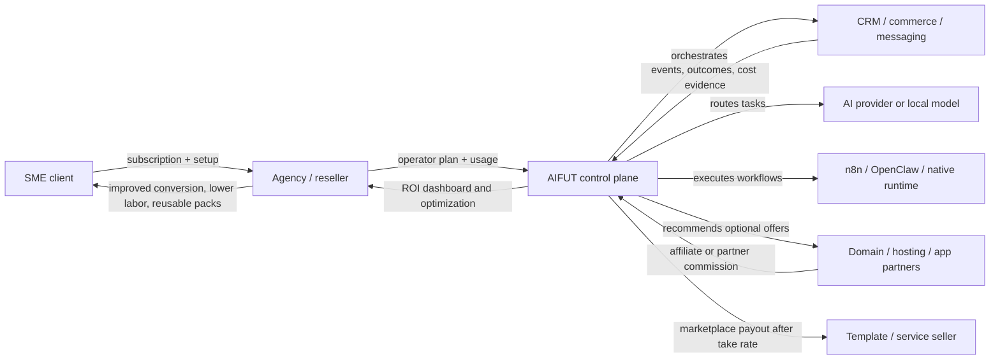
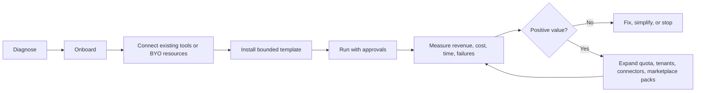
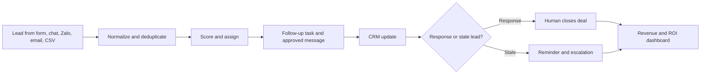

# AIFUT Revenue Engine and Market Entry

## Decision

AIFUT should not sell a generic "AI platform" first. It should sell measurable operating packs:

1. `Agency / Reseller Operator Stack` as the primary wedge.
2. `Revenue Recovery Pack` for service SMEs as the first repeatable downstream pack.
3. `Commerce Growth Pack` after sales attribution is stable.

The commercial promise is not guaranteed income. The promise is:

> AIFUT helps a business launch a measurable revenue experiment quickly, with reversible integrations, explicit costs, approval controls, and an ROI dashboard.

## Why this wedge

Agency and reseller operators have a painful multi-tenant problem: each client adds CRM, automation, AI, reporting, credentials, domains, and support overhead. One AIFUT sale can create multiple downstream tenants and recurring usage.

Service SMEs often already have leads but lose money through slow response, missed follow-up, fragmented data, and weak reporting. AIFUT can address this with a bounded workflow before attempting a broad business operating system.

## Market reference points

These are reference prices and market facts, not AIFUT revenue guarantees.

- OECD states that SMEs represent around 99% of firms across OECD countries and generate 50% to 60% of value added on average.
- APEC cites Viet Nam SMEs as nearly 98% of enterprises and identifies digital transformation cost as a major difficulty for 60.1% of surveyed SMEs.
- MISA AMIS CRM currently lists Viet Nam CRM tiers from VND 55,000 to VND 105,000 per user per month on its pricing page, with annual payment required.
- HighLevel currently lists agency plans at USD 97, USD 297, and USD 497 per month. Its USD 497 Agency Pro tier includes SaaS Mode and automated sub-account creation.
- n8n currently lists hosted Starter at EUR 20 per month for 2,500 workflow executions and Pro at EUR 50 per month for 10,000 executions, billed annually.
- Shopify currently lists annualized Basic, Grow, and Advanced plans at USD 29, USD 79, and USD 299 per month.
- Stripe standard US pricing currently lists 2.9% plus USD 0.30 per successful domestic card transaction and a starting 0.25% fee for platforms that deploy their own payments pricing.
- OpenAI currently lists GPT-5.4 mini at USD 0.75 per 1M input tokens and USD 4.50 per 1M output tokens. Batch processing can reduce eligible asynchronous processing cost by 50%.

## Customer segments

| Priority | Customer | Pain | Buying trigger | AIFUT pack |
| --- | --- | --- | --- | --- |
| 1 | Agency, consultant, reseller managing 5-30 SME clients | Too many client tools, credentials, failures, reports, and support requests | New client onboarding becomes slow and low-margin | Agency / Reseller Operator Stack |
| 2 | Service SME with 3-20 sales or support staff and 200+ leads per month | Leads are missed, follow-up is inconsistent, owner cannot see pipeline health | Paid leads are being wasted or headcount is rising | Revenue Recovery Pack |
| 3 | Ecommerce operator with meaningful existing order volume | Campaign, order, support, content, and affiliate data are fragmented | Store growth creates operational overload | Commerce Growth Pack |
| 4 | Technical operator or local-first business | Wants low cost, data control, and replaceable providers | SaaS lock-in or cloud cost is unacceptable | BYO / Sovereign Operator Pack |

Avoid starting with businesses that have no lead flow, no sellable offer, and no operator willing to review metrics. Software cannot manufacture product-market fit.

## Value and cash-flow map



## Service lifecycle



| Stage | User value | AIFUT revenue | Proof required |
| --- | --- | --- | --- |
| Diagnose | Baseline leak and opportunity report | Free or low-cost audit | Existing lead, order, and labor baseline |
| Onboard | Fast setup with existing tools | One-time setup fee | Connector health, mappings, owner approval |
| Operate | Automated follow-up, tasks, alerts, reporting | Monthly subscription and bounded usage | Workflow runs, outcomes, cost attribution |
| Optimize | Improve conversion and remove low-value steps | Upgrade, premium optimization, services | Cohort comparison and recommendation history |
| Replicate | Clone proven pack across clients | Reseller fee, template fee, marketplace take rate | Template version, tenant-specific config |
| Refer | Buy optional infrastructure or apps contextually | Affiliate or partner commission | Clear disclosure and user choice |

## Initial pack: Revenue Recovery



This pack satisfies a concrete need: recover value from leads that the customer already paid to acquire. It does not require AIFUT to promise that AI will create demand from nothing.

## Planning economics: Viet Nam SME pilot

Use these as pilot assumptions and replace them with measured tenant data after 30 days.

| Item | Monthly planning assumption |
| --- | ---: |
| Existing inbound leads | 500 |
| Average gross profit per additional closed deal | VND 2,000,000 |
| Additional deals recovered by faster follow-up | 2 |
| Manual work saved | 35 hours |
| Loaded labor value | VND 60,000 / hour |
| Tool consolidation saving | VND 500,000 |
| AIFUT subscription | VND 990,000 |
| AI / message / infrastructure allowance | VND 250,000 |

Customer-side monthly gross benefit:

`(2 x 2,000,000) + (35 x 60,000) + 500,000 = VND 6,600,000`

Customer-side monthly net value after AIFUT and allowance:

`6,600,000 - 990,000 - 250,000 = VND 5,360,000`

If the one-time setup fee is VND 3,000,000, the modeled first-month net value remains VND 2,360,000. This must be validated by a pilot; it is not a guarantee.

## Planning economics: international agency / reseller

| Item | Monthly planning assumption |
| --- | ---: |
| SME sub-accounts | 10 |
| Agency charge per client | USD 149 |
| Agency revenue | USD 1,490 |
| AIFUT reseller operator plan | USD 299 |
| Usage allowance and third-party variable cost | USD 150 |
| Agency contribution before its labor and sales cost | USD 1,041 |

AIFUT should win by making the agency's client onboarding, health monitoring, reporting, and pack replication easier while preserving provider choice. HighLevel's current USD 297 and USD 497 agency tiers are useful pricing anchors, but AIFUT should differentiate through governed orchestration, BYO resources, local-first operation, and replaceable adapters.

## Planning economics: AIFUT at 100 Viet Nam tenants

| Item | Monthly planning assumption |
| --- | ---: |
| 100 paid tenants x VND 990,000 | VND 99,000,000 |
| Managed usage margin | VND 12,000,000 |
| Marketplace and partner revenue | VND 8,000,000 |
| Setup services amortized into monthly view | VND 15,000,000 |
| Total revenue | VND 134,000,000 |
| Infrastructure, AI, messaging, and payment cost | VND 24,000,000 |
| Support and onboarding delivery cost | VND 35,000,000 |
| Sales, partner, and commission cost | VND 20,000,000 |
| Contribution before fixed product cost and tax | VND 55,000,000 |

This scenario is only attractive if onboarding becomes template-driven. If support remains custom consulting for every tenant, AIFUT becomes a service agency rather than a scalable platform.

## Pricing ladder

| Package | Viet Nam planning price | International planning price | Purpose |
| --- | ---: | ---: | --- |
| Free ecosystem | VND 0 | USD 0 | BYO resources, limited workflows, template discovery |
| SME Revenue Recovery | VND 990,000 / month | USD 49 / month | One measurable revenue loop |
| Growth Operator | VND 2,490,000 / month | USD 99 / month | More workflows, analytics, connectors, approvals |
| Agency / Reseller | VND 4,900,000 / month | USD 299 / month | Multi-tenant control room and pack replication |
| White-label Pro | From VND 9,900,000 / month | From USD 499 / month | Branding, higher limits, SLA, margin controls |

Usage should remain transparent. Tenants may choose:

- `BYO`: tenant pays the provider directly and pays AIFUT for orchestration.
- `AIFUT-managed`: AIFUT includes or resells a bounded allowance with visible overages.
- `Partner-managed`: tenant buys through a disclosed partner offer and AIFUT may receive a commission.

## Trust contract

AIFUT should display a preflight card before installation:

```text
Expected monthly platform fee
Expected external provider cost
Baseline metric
Target metric
Measurement period
Approval points
Data location
Connector replacement path
Stop / export path
```

The operator dashboard should then report:

```text
Money recovered or attributed
Labor hours saved
Tool cost avoided
AI and infrastructure spend
Workflow failures
Net value
Evidence confidence
Recommended next action
```

## Commercial kernel implications

The next implementation slice should support:

1. Provider catalog and resource offer.
2. Cost ownership: AIFUT-managed, partner-managed, or tenant-owned.
3. Offer entitlement and quota.
4. Usage attribution and billing preview.
5. Outcome attribution and ROI preview.
6. Template version, install, stop, and replace flow.
7. Reseller tenant tree and margin preview.

## Source links

- OECD SMEs and entrepreneurship: https://www.oecd.org/en/topics/smes-and-entrepreneurship.html
- APEC SME digital transformation report: https://www.apec.org/docs/default-source/publications/2023/4/what-comes-after-sme-digital-transformation/223_sme_what-comes-after-sme-digital-transfromation.pdf
- MISA AMIS CRM pricing: https://amis.misa.vn/bang-gia-phan-mem-misa-amis-crm/
- HighLevel pricing: https://www.gohighlevel.com/pricing
- n8n pricing: https://n8n.io/pricing/
- Shopify pricing: https://www.shopify.com/pricing
- Stripe pricing: https://stripe.com/pricing
- OpenAI API pricing: https://openai.com/api/pricing/

